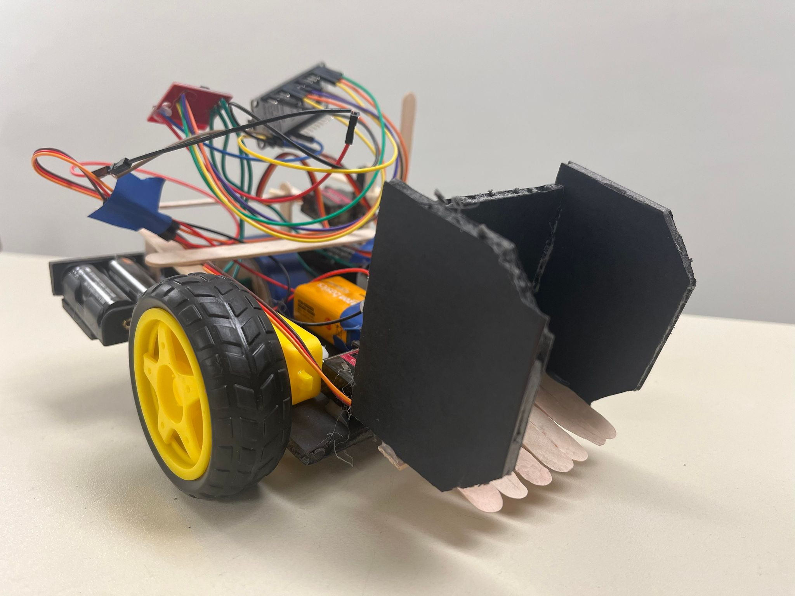

 
  

  &#xa0;

<!-- <a href="https://8266stub.netlify.app">Demo</a> -->

<h1 align="center">8266Stub</h1>

  

  ``

  ``

<!--  -->

<!--  -->

<!--  -->

<!-- Status -->

<!-- <h4 align="center"> 
	🚧  8266Stub 🚀 Under construction...  🚧
</h4> 

 -->

  <a href="#dart-about">About</a>   |   
  <a href="#sparkles-features">Features</a>   |  
  <a href="#rocket-technologies">Technologies</a>   |  
  <a href="#white_check_mark-requirements">Requirements</a>   |  
  <a href="#checkered_flag-starting">Starting</a>   |  
  <a href="#memo-license">License</a>   |  
  <a href="https://github.com/KILLERWHOPPER" target="_blank">Author</a>

 

## 🎯 About

A frameware for remote control robot. For QEC 2024 Senior Engineering.

## ✨ Features

✔️ Remote Control through Wifi and HTTP request;
✔️ Press to trigger action, release to stop;
✔️ High precision;

## 🚀 Technologies

The following tools were used in this project:

- [PlatformIO](https://platformio.org/?utm_source=platformio&utm_medium=piohome)
- [ESP8266](https://www.espressif.com/en/products/socs/esp8266)
- [Arduino-ESP32](https://github.com/espressif/arduino-esp32)

## ✅ Requirements

- ESP8266 NodeMCU
- Micro Servo
- DC motor
- 2-channel H-bridge
- Android phone

## 🏁 Starting

- Clone this project
- Open with Platform IO
- Wriring
- Install remote control app on the phone
- Start hotspot on the phone
- Modify SSID and password in [diy_wifi.hpp](src/wifi_module/diy_wifi.hpp)
- Flash frameware to board
- fill the ip address in app
- Have fun!
  

## 📝 License

This project is under license from MIT. For more details, see the [LICENSE](LICENSE.md) file.

Made with ❤️ by `<a href="https://github.com/KILLERWHOPPER" target="_blank">`KILLERWHOPPER `</a>`

&#xa0;

`<a href="#top">`Back to top `</a>`
